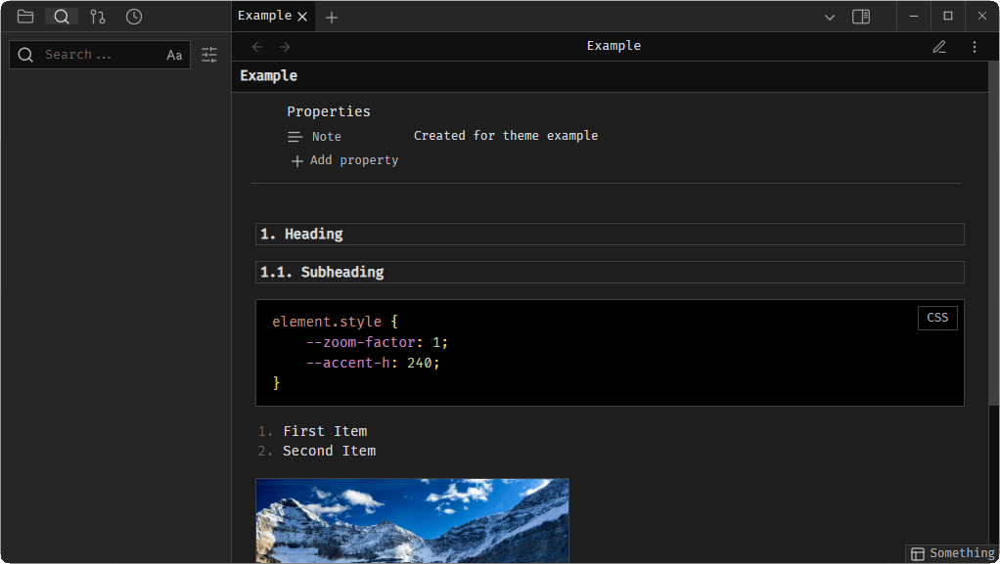

# Strict Obsidian Theme

Simple compact strict dark theme for Obsidian.

View Mode:

Edit Mode:

Differences from the default theme:

- The corners of many elements are pointed;
- Animations are disabled;
- Some indents between elements have been reduced;
- The application header and tabs is made smaller;
- Dark highlighting of input fields and main elements;
- Line numbers are decorated;
- The text is justified (except for code blocks);
- The code blocks are made darker, and the colors mimic VS Code;
- Images have max-height;
- Headings have the size of the main text and are highlighted with a border.
